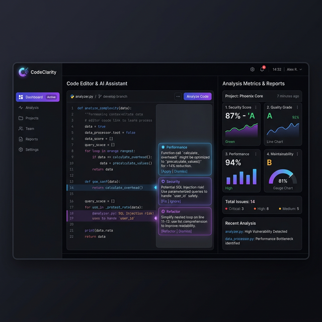

# 🚀 CodeClarity Pro: AI-Powered Code Intelligence

> **The 24/7 Senior Developer on your team** — Instant, high-fidelity code reviews that help you ship cleaner, safer, and faster code.

<div align="center">
  <a href="https://code-clarity-app.vercel.app/" target="_blank">
    
  </a>
</div>

<div align="center">
  
  
  
  
  
</div>

---

## ✨ Why CodeClarity Pro?

CodeClarity Pro isn't just a linter — it's a deep-thinking AI collaborator. It understands the context of your changes, finds subtle bugs, and suggests modern best practices in real-time.

- 🤖 **Gemini 2.0 Engine**: Powered by the latest Google AI for deep semantic code understanding.
- ⚡ **Automated PR Reviews**: Connect your GitHub and let the AI review every pull request automatically.
- 🔒 **Security-First**: Detects SQL injection, hardcoded secrets, and XSS vulnerabilities before they ship.
- 🗣️ **Voice Analysis**: Listen to your code review with high-quality text-to-speech.
- 📊 **Quality Scoring**: Quantitative metrics for maintainability, complexity, and performance.

---

## 📸 Experience the Future



---

## 🎯 Key Features

### 1. Automated Pull Request Analysis
Connect your GitHub App to **automatically** receive AI comments and quality checks on every PR. It calculates a "Quality Score" and sets commit statuses directly on GitHub.

### 2. Manual Code Analyzer
Upload any file or paste code snippets for instant, one-off analysis. Perfect for quick logic checks or refactoring advice.

### 3. Smart History & Dashboard
Your personal history of code analyses, stored securely via Firebase. Track your improvement over time and revisit previous suggestions.

### 4. Premium UI/UX
A stunning, responsive interface built with **Vite**, **Tailwind CSS**, and **Framer Motion**. Features dark mode, glassmorphism, and smooth micro-animations.

---

## 🛠️ Tech Stack

- **Framework**: Next.js 15 (App Router)
- **AI**: Genkit + Gemini 2.0 Flash
- **Database**: Firestore (NoSQL)
- **Auth**: Firebase Auth (GitHub + Email)
- **Queueing**: BullMQ + Redis (for async PR analysis)
- **API**: Octokit (GitHub Integration)
- **Icons**: Lucide React

---

## 🏁 Getting Started

### 1. Clone & Install
```bash
git clone https://github.com/deepakpatil26/code-clarity-app.git
cd code-clarity-app
npm install
```

### 2. Environment Setup
Create a `.env.local` file with:
```env
# AI
GEMINI_API_KEY=your_key

# Firebase (Client)
NEXT_PUBLIC_FIREBASE_API_KEY=...
NEXT_PUBLIC_FIREBASE_AUTH_DOMAIN=...
# ... (Full Firebase Config)

# GitHub App (for PR Reviews)
GITHUB_APP_ID=...
GITHUB_APP_PRIVATE_KEY=...
GITHUB_WEBHOOK_SECRET=...

# Backend
REDIS_URL=...
FIREBASE_SERVICE_ACCOUNT_KEY=...
```

### 3. Run Development
```bash
npm run dev
```

The app will be available at `http://localhost:3000`.

---

## 🤝 Contributing & License

Contributions are welcome! Please see the [LICENSE](LICENSE) for details.

<div align="center">
  Made with 💎 by Deepak Patil
</div>
