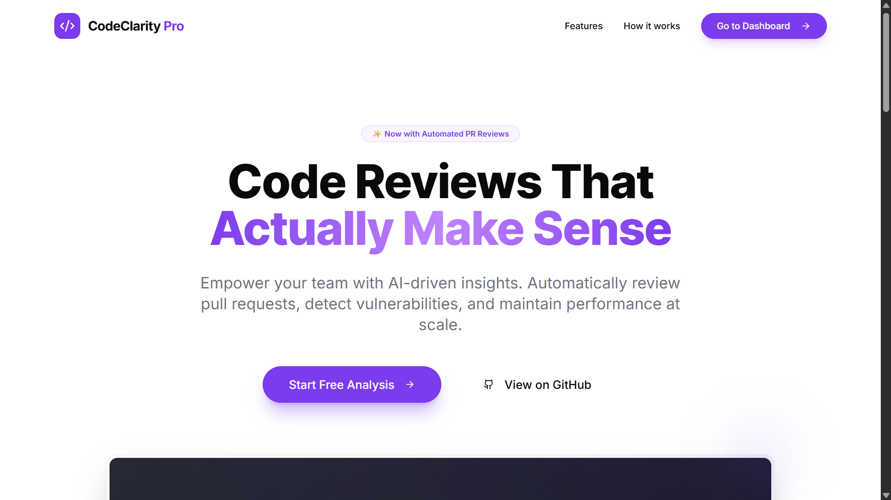
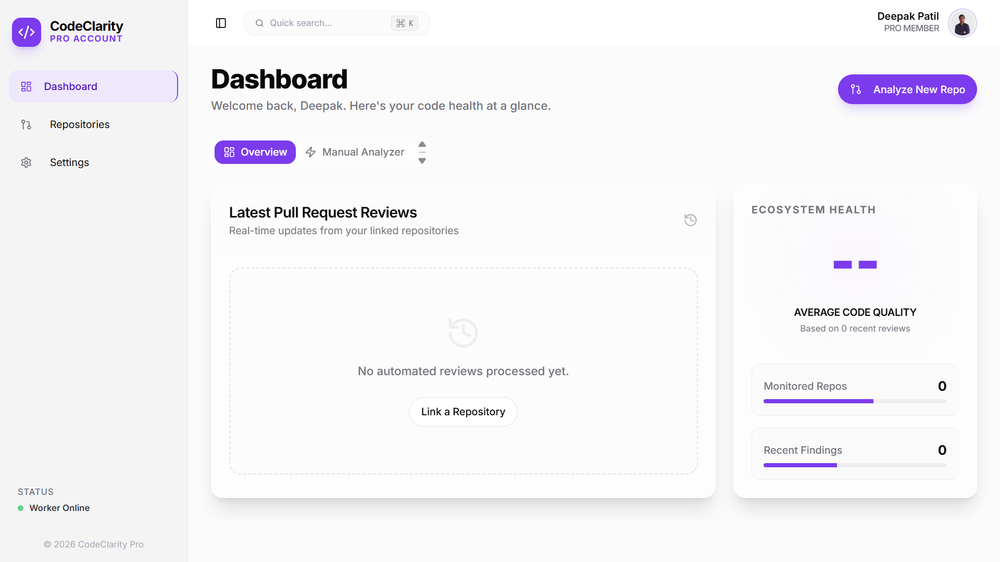
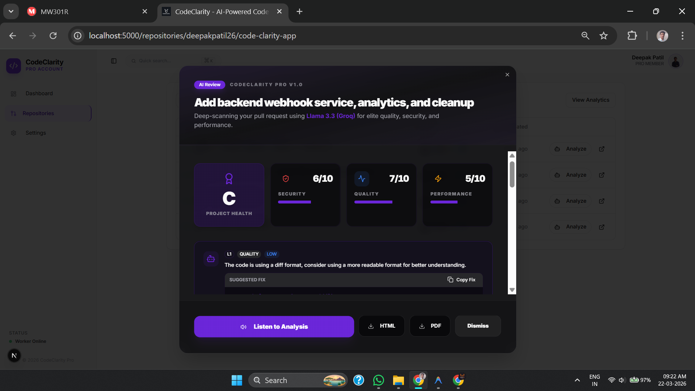

# 🚀 CodeClarity Pro: AI-Powered Code Intelligence

> **The 24/7 Senior Developer on your team** — Instant, high-fidelity code reviews that help you ship cleaner, safer, and faster code.

<div align="center">
  <a href="https://code-clarity-app.vercel.app/" target="_blank">
    
  </a>
</div>

<div align="center">
  
  
  
  
  
</div>

---

## ✨ Why CodeClarity Pro?

CodeClarity Pro isn't just a linter — it's a deep-thinking AI collaborator. It understands the context of your changes, finds subtle bugs, and suggests modern best practices in real-time.

- ⚡ **Groq LPU™ Engine**: Powered by Groq's Lighting-Fast LPU™ for analysis in seconds (Llama 3.3 70B Versatile).
- 🧬 **Diff-Guard™ Technology**: Advanced context truncation ensures even massive pull requests are analyzed without error.
- 💬 **Interactive AI Explainer**: Click any finding to chat with the AI for a deeper explanation or a customized fix.
- ⚡ **Automated PR Reviews**: Connect your GitHub and let the AI review every pull request automatically.
- 📊 **Pro Dashboard**: Real-time quantitative health scores (A+ to F) for Security, Quality, and Performance.
- 📄 **Professional Reports**: One-click download of branded technical reports for team sharing.
- 🔒 **Security-First**: Detects SQL injection, hardcoded secrets, and XSS vulnerabilities before they ship.

---

## 📸 Experience CodeClarity Pro


_The next-generation landing page for AI-driven code intelligence._

### 🍱 Feature Highlights

|              User Dashboard               |            AI Analysis Results             |
| :---------------------------------------: | :----------------------------------------: |
|  |     |
|    Track your history & health scores     | Deep-dive into security & quality findings |

---

## 🎯 Key Features

### 1. Automated Pull Request Analysis

Connect your GitHub App to **automatically** receive AI comments and quality checks on every PR. It calculates a "Quality Score" and sets commit statuses directly on GitHub.

### 2. Manual Code Analyzer

Upload any file or paste code snippets for instant, one-off analysis. Perfect for quick logic checks or refactoring advice.

### 3. Smart History & Dashboard

Your personal history of code analyses, stored securely via Firebase. Track your improvement over time and revisit previous suggestions.

### 4. Premium UI/UX

A stunning, responsive interface built with **Vite**, **Tailwind CSS**, and **Framer Motion**. Features dark mode, glassmorphism, and smooth micro-animations.

---

## 🛠️ Tech Stack

- **Framework**: Next.js 15 (App Router)
- **AI**: Genkit + Groq (Llama 3.3 70B / Mistral)
- **Database**: Firestore (NoSQL)
- **Auth**: Firebase Auth (GitHub + Email)
- **Queueing**: BullMQ + Redis (for async PR analysis)
- **API**: Octokit (GitHub Integration)
- **Icons**: Lucide React

---

## 🏁 Getting Started

### 1. Clone & Install

```bash
git clone https://github.com/deepakpatil26/code-clarity-app.git
cd code-clarity-app
npm install
```

### 2. Environment Setup

Create a `.env.local` file with:

```env
# AI (Groq Setup)
OPENAI_API_KEY=gsk_your_groq_key_here
OPENAI_BASE_URL=https://api.groq.com/openai/v1
GROQ_API_KEY=gsk_your_groq_key_here

# Firebase (Client)
NEXT_PUBLIC_FIREBASE_API_KEY=...
NEXT_PUBLIC_FIREBASE_AUTH_DOMAIN=...
# ... (Full Firebase Config)

# GitHub App (for PR Reviews)
GITHUB_APP_ID=...
GITHUB_APP_PRIVATE_KEY=...
GITHUB_WEBHOOK_SECRET=...

# Backend
REDIS_URL=...
FIREBASE_SERVICE_ACCOUNT_KEY=...
BACKEND_PORT=9100
```

### 3. Run Development

```bash
npm run dev

# In a separate terminal (webhook backend)
npm run backend:dev
```

The app will be available at `http://localhost:3000`.

### 4. GitHub Webhook URL

Point your GitHub App webhook URL to the backend service:

```
http://localhost:9100/webhooks/github
```

---

## 🤝 Contributing & License

Contributions are welcome! Please see the [LICENSE](LICENSE) for details.

<div align="center">
  Made with 💎 by Deepak Patil
</div>
